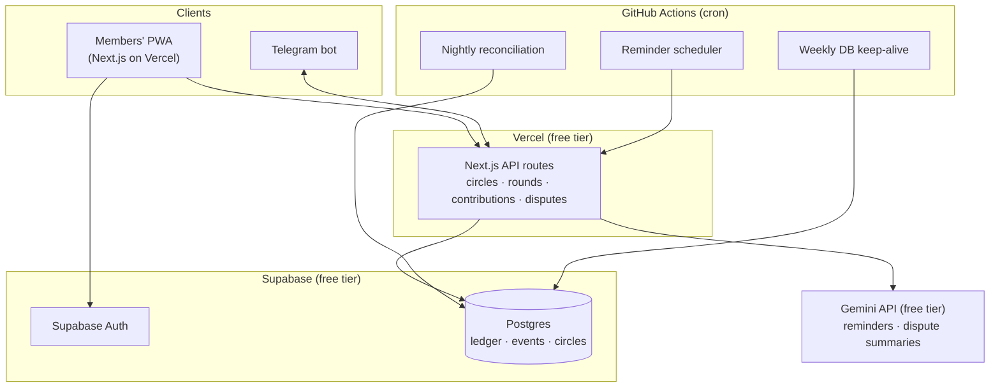
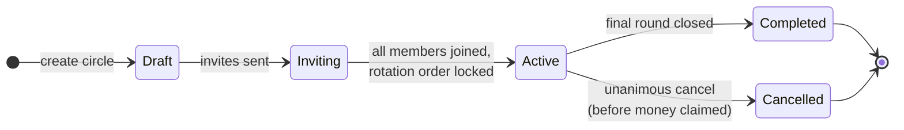
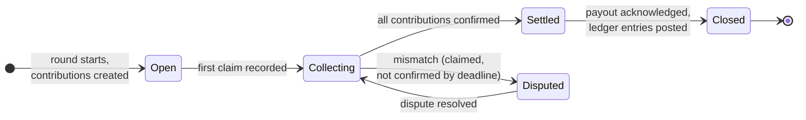
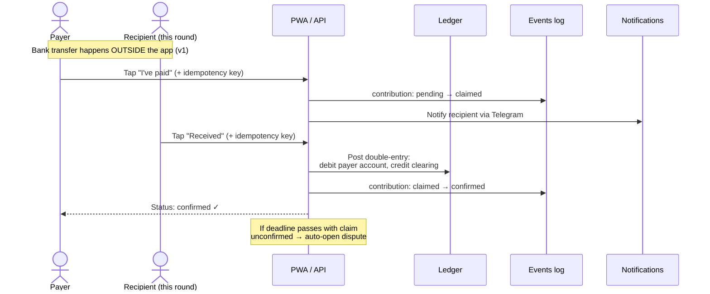
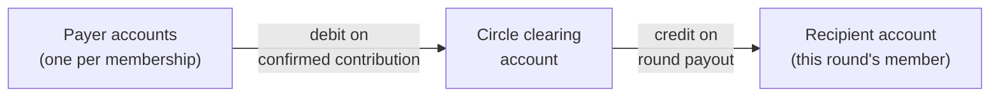
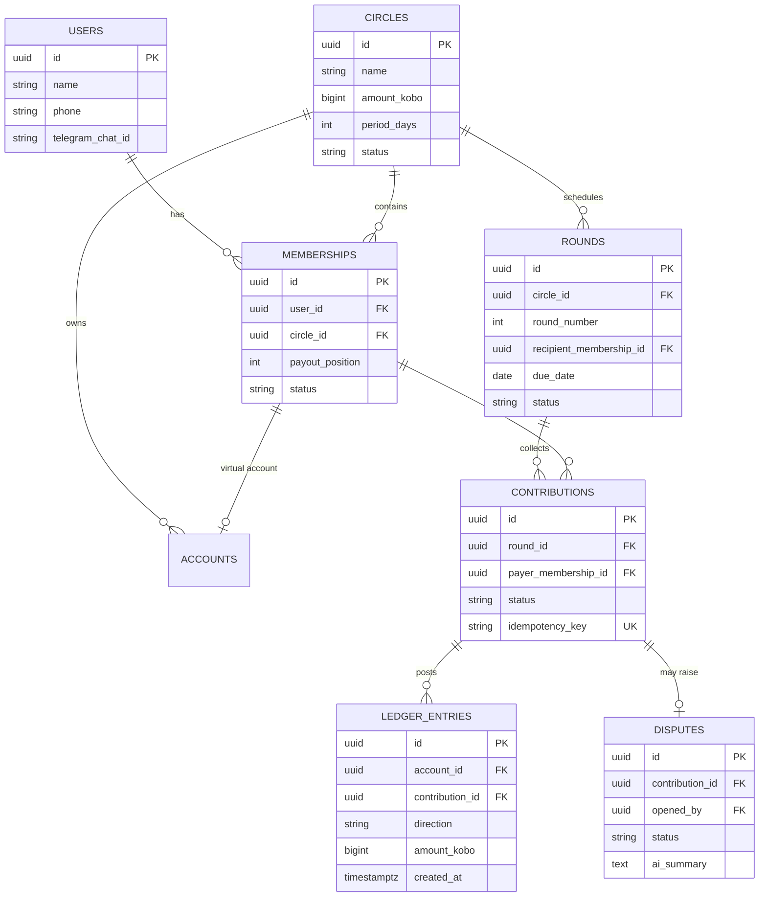
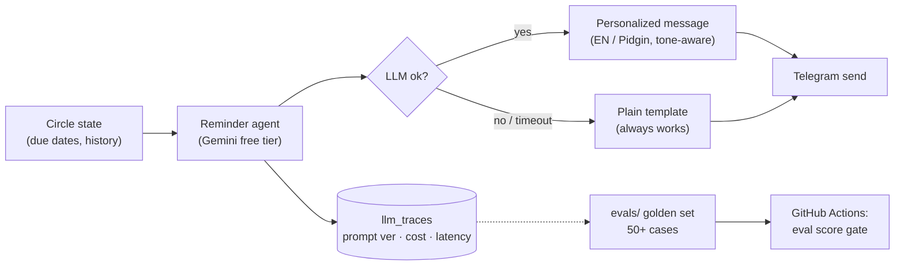

# ARCHITECTURE.md — Circle

> Diagrams are in **Mermaid** — they render natively on GitHub and in VS Code (install the "Markdown Preview Mermaid Support" extension, then open preview with `Ctrl+Shift+V`).

---

## 1. System architecture ($0 stack, v1)

**Key property:** money never enters this system in v1. Bank transfers happen between members outside the app; the app is the ledger, referee, and reminder brain.

---

## 2. Circle & round state machines

**Rule:** these transitions are the ONLY way state changes. Every transition writes a row to `events` (actor, from_state, to_state, timestamp, metadata). No state is ever inferred from scattered boolean flags.

---

## 3. Contribution flow (the core loop)

Payout at round close mirrors this: clearing account → recipient account, both sides posted atomically in one transaction.

---

## 4. Double-entry ledger model

Invariants (tested, enforced):
- Every movement = exactly 2 rows (debit + credit), same `amount_kobo`, same transaction.
- `SUM(signed amount) over ledger_entries = 0` — always.
- `ledger_entries` is append-only: the DB role used by the app has **no UPDATE or DELETE grant** on this table. Corrections are reversing entries.
- Balances are computed from entries, never stored as mutable columns.
- Amounts are `BIGINT` kobo. Floats are forbidden in any money path.

---

## 5. Entity-relationship diagram

Supporting tables (not shown): `events` (audit backbone), `notifications_log`, `llm_traces`, `accounts`.

---

## 6. AI layer & eval loop

The same fallback + tracing + eval pattern applies to the dispute assistant. **LLM features are enhancements, never dependencies** — nothing user-critical breaks if the model is down or rate-limited.

---

## 7. Debugging map — "where do I look when X breaks?"

| Symptom | Look at (in order) |
|---|---|
| "My payment isn't showing" | `contributions.status` → `events` for that contribution → idempotency key collisions |
| Balance looks wrong | `ledger_entries` for the account → reconciliation job output → NEVER edit rows; post a reversing entry |
| Circle stuck in a state | `events` (last transition + actor) → state machine guards in code |
| Reminder never arrived | `notifications_log` → GitHub Action run logs → Telegram chat_id linkage |
| AI said something wrong | `llm_traces` (exact prompt + output) → add the case to `evals/` → fix prompt → CI proves it |
| Anything money-related drifts | Reconciliation report — it names the account and the delta |
